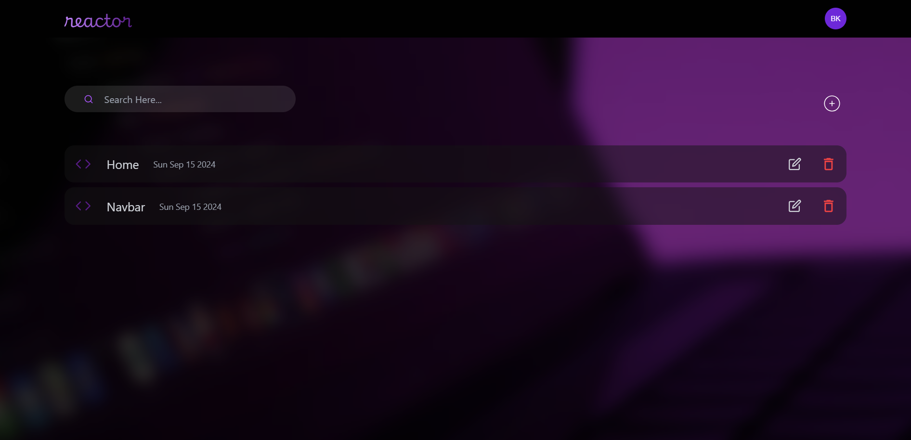

# Reactor


## Description

**Reactor** is a powerful, streamlined platform that allows developers to effortlessly write, preview, and refine React components, with seamless integration of Tailwind CSS. Whether you're prototyping or building production-ready components, Reactor removes the setup complexity, leaving you with a pure focus on creativity. 

Leveraging the MERN stack and Google Getmini AI, Reactor offers personal AI assistance for debugging and searching through your code efficiently. It comes with built-in user authentication and authorization to provide secure, personalized experiences.

## Features

- **No Setup Required:** Jump into writing React components immediately.
- **Tailwind CSS Integration:** Easily style your components using Tailwind's utility-first framework.
- **Live Preview:** Instantly see how your React components render in real-time.
- **AI Assistance:** Integrated with Google Getmini AI for quick code searches and debugging support.
- **User Authentication & Authorization:** Secure login/signup flow using JWT tokens.
- **Multiple Pages:** Navigate through essential pages like login, signup, home, code editor, and more.

## Pages Overview

1. **Login Page:** User authentication with JWT tokens.
2. **Signup Page:** New user registration.
3. **Home Page:** Overview of your projects and recent activities.
4. **Create a New Project:** Kickstart a new project effortlessly.
5. **Code Editor:** Write and preview your React components with AI assistance and live rendering.
6. **AI Chatbot Assistance:** Get real-time help from an AI assistant for debugging and code search.
7. **404 Page (Not Found):** Friendly navigation fallback when a page doesn’t exist.

## Tech Stack

- **Frontend:** React, Tailwind CSS
- **Backend:** Node.js, Express.js, MongoDB
- **Authentication:** JWT (JSON Web Token)
- **AI Integration:** Google Getmini AI
- **Version Control:** Git

## Installation

To get started with **Reactor**, follow these steps:

1. **Clone the repository:**

   ```bash
   git clone https://github.com/bidyut10/Reactor.git
   ```

2. **Install dependencies for both the frontend and backend:**

   ```bash
   # For backend
   cd server
   npm install
   
   # For frontend
   cd ../client
   npm install
   ```

3. **Set up environment variables:**

   Create a `.env` file in both `backend` and `frontend` folders based on the `.env.example` files.

4. **Run the application:**

   ```bash
   # In backend folder
   npm start
   
   # In frontend folder
   npm run dev
   ```

5. **Access the app in your browser at:**

   ```
   http://localhost:5173/
   ```

## Sample UI

Here are some UI samples of the project:





## Contributing

We welcome contributions! Feel free to open issues, submit pull requests, or suggest new features. Please make sure to follow our code of conduct and contribution guidelines.

## License

This project is licensed under the MIT License - see the [LICENSE](LICENSE) file for details.

---

**Reactor**: Unleash your creativity. Code with ease.